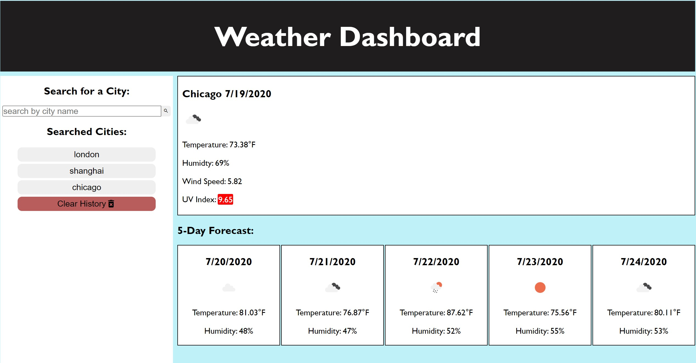

# Weather Report

A simple weather website to save searches 

Github: https://github.com/kwedwick/weather-project
Live Webpage: https://kwedwick.github.io/weather-project/

## Table of Contents

- [Planning](#planning)
- [Issues](#issues)
- [Future Support](#future-support)
- [Photo](#photo)

## Planning
1. Downloaded the sample image to have an HTML wireframe
2. Psuedo-coded the javascript functions that would be needed
3. Styled the basic website by choosing three colors
4. Read Openweather API documentation

## Issues
- First issue was realizing the current weather API call didn't include everything I needed. I needed to make two separate calls to get the 5 day forecast
- The button creation was the biggest issue. It would either not work or do an infinite button creation.
    - I realized after taking a break that I needed to restructure my JS functions and condense some so the button press wasn't pulling at the start with the button creation also in that same function.
    - The new issue this created was now the button would no longer have a capital letter and is subjected to what the user inputs.

## Future Support
- Current issue would be taking the string to cut the first letter off and replace it with a capital jquery function
- I would need to create a unique API call that the Searched Cities Button calls that doesn't feed into the initial API call, therefore having two different cascading API call functions. 

## Photo
Here is the screenshot of the main page

